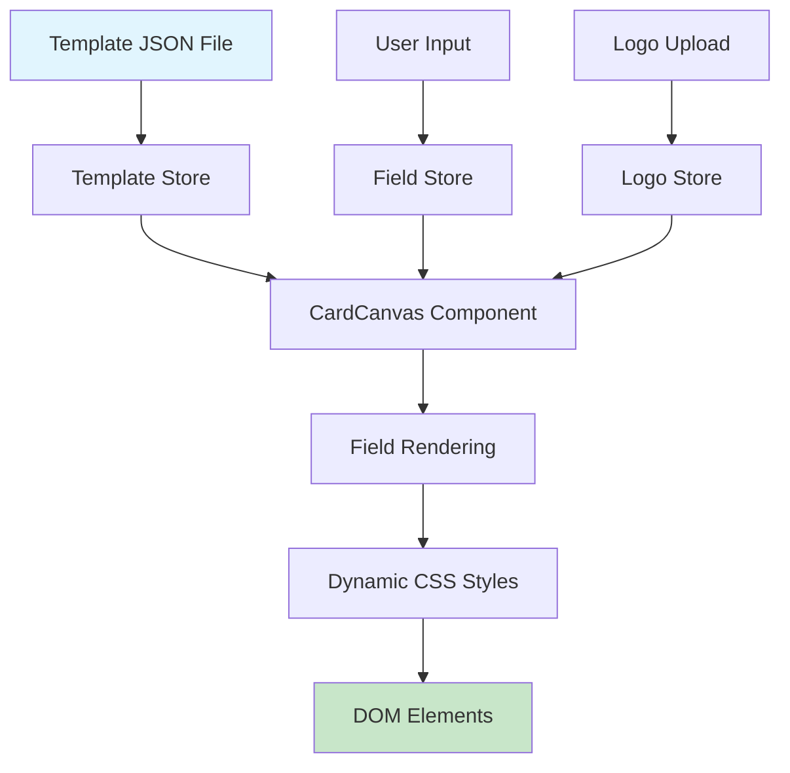

# Visiting Card Designer - Styling System Documentation

## Table of Contents

1. [System Overview](#system-overview)
2. [Template Structure](#template-structure)
3. [Card Layout System](#card-layout-system)
4. [Field Positioning & Styling](#field-positioning--styling)
5. [Background & Shape System](#background--shape-system)
6. [Typography System](#typography-system)
7. [Coordinate System](#coordinate-system)
8. [Template Configuration](#template-configuration)
9. [API Data Implementation](#api-data-implementation)
10. [Creating Custom Templates](#creating-custom-templates)
11. [Field Types & Validation](#field-types--validation)
12. [Responsive Considerations](#responsive-considerations)
13. [Dynamic Styling Implementation](#dynamic-styling-implementation)

---

## System Overview

The visiting card designer uses a **coordinate-based positioning system** with absolute positioning to place elements precisely on a fixed-size canvas. The system is built around three core concepts:

1. **Templates**: JSON-based configurations defining the layout and styling
2. **Shapes**: Background elements, decorative shapes, and layout guides
3. **Fields**: Text input areas with specific positioning and typography

### Canvas Specifications

- **Standard Size**: 643px × 383px (business card proportions)
- **Coordinate System**: Top-left origin (0,0)
- **Units**: All measurements in pixels
- **Background**: White by default, customizable per template

---

## Template Structure

Each template is defined as a JSON object with the following structure:

```typescript
interface TemplateDesign {
  id: string; // Unique identifier
  name: string; // Display name
  size: { width: number; height: number }; // Canvas dimensions
  background: { color?: string } | null; // Background color
  shapes: Shape[]; // Decorative elements
  fields: FieldSpec[]; // Input field definitions
  defaults?: Partial<Record<FieldKey, string>>; // Default values
  previewThumb?: string; // Preview image URL
}
```

### Example Template Structure

```json
{
  "id": "modernSimple",
  "name": "Modern Simple",
  "size": { "width": 643, "height": 383 },
  "background": { "color": "#FFFFFF" },
  "shapes": [
    {
      "type": "rect",
      "x": 20,
      "y": 20,
      "w": 603,
      "h": 343,
      "fill": "#FFFFFF",
      "radius": 12
    },
    {
      "type": "image",
      "x": 20,
      "y": 20,
      "w": 603,
      "h": 343,
      "path": "/card-background-images/modern-simple.jpg",
      "fit": "cover",
      "radius": 12
    }
  ],
  "fields": [
    /* field definitions */
  ],
  "defaults": {
    /* default values */
  }
}
```

---

## Card Layout System

### Layout Principles

1. **Fixed Canvas**: All templates use a consistent canvas size for predictable layouts
2. **Absolute Positioning**: Every element has exact pixel coordinates
3. **Layering**: Shapes render first, then fields on top
4. **Non-overlapping**: Fields are positioned to avoid content overlap

### Layout Zones

Templates typically divide the card into logical zones:

#### Zone 1: Primary Information (Names & Title)

- **Location**: Upper portion (y: 90-170)
- **Usage**: Name fields and job title
- **Typography**: Larger fonts (16-20px), bold weights

#### Zone 2: Contact Details

- **Location**: Middle section (y: 180-260)
- **Usage**: Phone, email, address
- **Typography**: Smaller fonts (13px), regular weight

#### Zone 3: Company Information

- **Location**: Lower section (y: 280-340)
- **Usage**: Company name, website
- **Typography**: Medium fonts (13-16px)

#### Zone 4: Logo Area

- **Location**: Top-right corner (x: 550+, y: 65+)
- **Usage**: Company logo or personal branding
- **Size**: Typically 73×73px

---

## Field Positioning & Styling

### Field Specification Structure

```typescript
interface FieldSpec {
  key: FieldKey; // Field identifier
  label?: string; // Display label
  box: BoundingBox; // Position and size
  style: TextStyle; // Typography settings
  placeholder?: string; // Placeholder text
}

interface BoundingBox {
  x: number; // Left offset from canvas origin
  y: number; // Top offset from canvas origin
  w: number; // Width in pixels
  h: number; // Height in pixels
}
```

### Field Types and Their Properties

#### 1. Name Fields (firstName, lastName)

**Typical Configuration:**

```json
{
  "key": "firstName",
  "box": { "x": 120, "y": 95, "w": 180, "h": 35 },
  "style": {
    "fontFamily": "Inter, ui-sans-serif",
    "fontSize": 20,
    "weight": "bold",
    "color": "#000000"
  },
  "placeholder": "First Name"
}
```

**Characteristics:**

- **Position**: Upper area (y: 90-130)
- **Size**: 180-240px width, 35px height
- **Typography**: 20px, bold weight
- **Layout**: Often side-by-side or stacked

#### 2. Occupation/Title Field

```json
{
  "key": "occupation",
  "box": { "x": 120, "y": 140, "w": 380, "h": 32 },
  "style": {
    "fontFamily": "Inter, ui-sans-serif",
    "fontSize": 16,
    "color": "#000000"
  },
  "placeholder": "Occupation"
}
```

**Characteristics:**

- **Position**: Below names (y: 140-175)
- **Size**: Full width (300-480px), 32px height
- **Typography**: 16px, regular weight

#### 3. Contact Fields (mobile, email, landline, fax)

```json
{
  "key": "mobile",
  "box": { "x": 320, "y": 185, "w": 180, "h": 27 },
  "style": {
    "fontFamily": "Inter, ui-sans-serif",
    "fontSize": 13,
    "color": "#000000"
  },
  "placeholder": "Mobile"
}
```

**Characteristics:**

- **Position**: Middle section (y: 180-250)
- **Size**: 180-240px width, 27px height
- **Typography**: 13px, regular weight
- **Layout**: Often in two columns

#### 4. Address Field (Special - Multiline)

```json
{
  "key": "address",
  "box": { "x": 120, "y": 245, "w": 180, "h": 45 },
  "style": {
    "fontFamily": "Inter, ui-sans-serif",
    "fontSize": 13,
    "color": "#000000",
    "lineHeight": 1.2
  },
  "placeholder": "Address"
}
```

**Characteristics:**

- **Position**: Middle-lower section (y: 240-290)
- **Size**: Taller height (45-50px) for multiple lines
- **Typography**: 13px with defined line height
- **Special**: Renders as `<textarea>` instead of `<input>`

#### 5. Company Field

```json
{
  "key": "company",
  "box": { "x": 120, "y": 295, "w": 180, "h": 27 },
  "style": {
    "fontFamily": "Inter, ui-sans-serif",
    "fontSize": 13,
    "color": "#000000"
  },
  "placeholder": "Company"
}
```

**Characteristics:**

- **Position**: Lower section (y: 290-330)
- **Size**: 180px width, 27px height
- **Typography**: 13px, regular weight

#### 6. Logo Field (Special - Image)

```json
{
  "key": "logo",
  "box": { "x": 550, "y": 65, "w": 73, "h": 73 },
  "style": {
    "fontFamily": "Inter, ui-sans-serif",
    "fontSize": 8,
    "color": "#6B7280",
    "align": "center"
  }
}
```

**Characteristics:**

- **Position**: Top-right corner
- **Size**: Square aspect ratio (73×73px)
- **Typography**: Small font for placeholder text
- **Special**: Renders as `` when populated

---

## Background & Shape System

### Shape Types

#### 1. Rectangle Shapes

```typescript
{
  type: "rect";
  x: number;      // Left position
  y: number;      // Top position
  w: number;      // Width
  h: number;      // Height
  fill: string;   // Background color (hex)
  radius?: number; // Border radius
}
```

**Usage Examples:**

- Card background containers
- Decorative panels
- Section dividers

#### 2. Image Shapes

```typescript
{
  type: "image";
  path: string;    // Image URL/path
  x: number;       // Left position
  y: number;       // Top position
  w: number;       // Width
  h: number;       // Height
  fit?: "cover" | "contain"; // Object fit
  radius?: number; // Border radius
}
```

**Usage Examples:**

- Background patterns
- Decorative images
- Brand elements

#### 3. Polygon Shapes

```typescript
{
  type: "polygon";
  points: Array<{ x: number; y: number }>; // Vertex coordinates
  fill: string; // Fill color
}
```

**Usage Examples:**

- Custom geometric shapes
- Decorative elements
- Design accents

#### 4. Dashed Rectangle (Guide)

```typescript
{
  type: "dashedRect";
  x: number;       // Left position
  y: number;       // Top position
  w: number;       // Width
  h: number;       // Height
  stroke: string;  // Border color
  dash: number[];  // Dash pattern [line, gap]
  radius?: number; // Border radius
}
```

**Usage Examples:**

- Logo placement guides
- Design boundaries
- Template helpers (hidden during export)

---

## Typography System

### Text Style Configuration

```typescript
interface TextStyle {
  fontFamily: string; // Font stack
  fontSize: number; // Size in pixels
  weight?: number | "bold"; // Font weight
  color: string; // Text color (hex)
  letterSpacing?: number; // Letter spacing
  lineHeight?: number; // Line height multiplier
  align?: "left" | "center" | "right"; // Text alignment
  uppercase?: boolean; // Text transformation
  opacity?: number; // Text opacity (0-1)
}
```

### Typography Hierarchy

#### Level 1: Primary Text (Names)

- **Font Size**: 20px
- **Weight**: Bold
- **Usage**: First name, last name
- **Color**: #000000

#### Level 2: Secondary Text (Occupation)

- **Font Size**: 16px
- **Weight**: Regular
- **Usage**: Job title, occupation
- **Color**: #000000

#### Level 3: Detail Text (Contact Info)

- **Font Size**: 13px
- **Weight**: Regular
- **Usage**: Phone, email, address, company
- **Color**: #000000

#### Level 4: Helper Text (Logo Placeholder)

- **Font Size**: 8px
- **Weight**: Regular
- **Usage**: Placeholder text, labels
- **Color**: #6B7280 (gray)

### Font Family

**Default Stack**: `"Inter, ui-sans-serif"`

- **Primary**: Inter (Google Font)
- **Fallback**: System UI sans-serif fonts
- **Characteristics**: Modern, clean, highly legible

---

## Coordinate System

### Origin and Axes

- **Origin**: Top-left corner (0, 0)
- **X-axis**: Increases rightward
- **Y-axis**: Increases downward
- **Units**: Pixels (px)

### Template Layout Coordinates

#### Standard Business Card (643×383px)

**Margin Guidelines:**

- **Left/Right Margins**: 20px minimum
- **Top/Bottom Margins**: 20px minimum
- **Content Area**: 603×343px (after margins)

**Typical Field Positions:**

| Field Type   | X Range | Y Range | Width Range | Height |
| ------------ | ------- | ------- | ----------- | ------ |
| First Name   | 60-120  | 90-110  | 180-240     | 35     |
| Last Name    | 280-355 | 90-110  | 180-240     | 35     |
| Occupation   | 60-120  | 140-175 | 380-480     | 32     |
| Contact Info | 60-355  | 180-260 | 180-240     | 27     |
| Address      | 60-320  | 245-280 | 180-240     | 45-50  |
| Company      | 60-120  | 290-335 | 180-240     | 27     |
| Logo         | 550+    | 65+     | 73          | 73     |

### Layout Patterns

#### Pattern 1: Two-Column Layout

```
[Name 1    ] [Name 2    ]
[Occupation across both ]
[Contact 1 ] [Contact 2 ]
[Contact 3 ] [Contact 4 ]
[Address   ] [Company   ] [Logo]
```

#### Pattern 2: Single-Column Layout

```
[Full Name           ]
[Occupation          ]
[Contact Info        ]
[Contact Info        ]
[Address             ] [Logo]
[Company             ]
```

#### Pattern 3: Left-Heavy Layout

```
[Names & Info     ] [Logo]
[All contact info ]
[on left side     ]
[Company          ]
```

---

## Template Configuration

### Configuration Workflow

1. **Define Canvas Size**

   ```json
   "size": { "width": 643, "height": 383 }
   ```

2. **Set Background**

   ```json
   "background": { "color": "#FFFFFF" }
   ```

3. **Add Background Shapes**

   ```json
   "shapes": [
     {
       "type": "image",
       "x": 20, "y": 20, "w": 603, "h": 343,
       "path": "/images/background.jpg",
       "fit": "cover",
       "radius": 12
     }
   ]
   ```

4. **Position Fields**

   ```json
   "fields": [
     {
       "key": "firstName",
       "box": { "x": 120, "y": 95, "w": 180, "h": 35 },
       "style": { /* typography */ }
     }
   ]
   ```

5. **Set Defaults**
   ```json
   "defaults": {
     "firstName": "",
     "lastName": ""
   }
   ```

### Field Ordering Considerations

Fields are rendered in the order they appear in the array. Consider:

1. **Visual hierarchy**: Important fields first
2. **Tab order**: Logical flow for keyboard navigation
3. **Template consistency**: Similar order across templates

---

## API Data Implementation

### 1. Template Management API

#### Endpoints Structure

```typescript
// Get all available templates
GET /api/templates
Response: TemplateDesign[]

// Get specific template
GET /api/templates/:id
Response: TemplateDesign

// Create new template
POST /api/templates
Body: TemplateDesign
Response: TemplateDesign

// Update template
PUT /api/templates/:id
Body: Partial<TemplateDesign>
Response: TemplateDesign

// Delete template
DELETE /api/templates/:id
Response: { success: boolean }
```

#### Template API Response Example

```json
{
  "id": "modern-business",
  "name": "Modern Business",
  "size": { "width": 643, "height": 383 },
  "background": { "color": "#FFFFFF" },
  "shapes": [
    {
      "type": "rect",
      "x": 20,
      "y": 20,
      "w": 603,
      "h": 343,
      "fill": "#F8F9FA",
      "radius": 12
    },
    {
      "type": "image",
      "x": 20,
      "y": 20,
      "w": 603,
      "h": 343,
      "path": "https://api.example.com/images/bg-modern.jpg",
      "fit": "cover",
      "radius": 12
    }
  ],
  "fields": [
    {
      "key": "firstName",
      "label": "First Name",
      "box": { "x": 80, "y": 100, "w": 200, "h": 35 },
      "style": {
        "fontFamily": "Inter, sans-serif",
        "fontSize": 20,
        "weight": "bold",
        "color": "#1F2937"
      },
      "placeholder": "Enter first name"
    }
  ],
  "defaults": {},
  "previewThumb": "https://api.example.com/previews/modern-business.jpg",
  "createdAt": "2024-01-15T10:30:00Z",
  "updatedAt": "2024-01-15T10:30:00Z"
}
```

### 2. User Data Management API

#### Card Data Storage

```typescript
interface CardData {
  id: string;
  templateId: string;
  fields: Record<FieldKey, string>;
  logo?: string; // Base64 or URL
  name: string;
  userId: string;
  createdAt: string;
  updatedAt: string;
}

// Save card design
POST /api/cards
Body: {
  templateId: string;
  fields: Record<FieldKey, string>;
  logo?: string;
  name: string;
}
Response: CardData

// Get user's cards
GET /api/cards
Response: CardData[]

// Update card
PUT /api/cards/:id
Body: Partial<CardData>
Response: CardData
```

### 3. Asset Management API

#### Background Images

```typescript
// Upload background image
POST /api/assets/backgrounds
Body: FormData (image file)
Response: {
  url: string;
  id: string;
  filename: string;
  size: number;
}

// Get available backgrounds
GET /api/assets/backgrounds
Response: Array<{
  id: string;
  url: string;
  name: string;
  category: string;
}>
```

#### Logo Management

```typescript
// Upload logo
POST /api/assets/logos
Body: FormData (image file)
Response: {
  url: string;
  id: string;
  filename: string;
}

// Get user logos
GET /api/assets/logos
Response: Array<{
  id: string;
  url: string;
  name: string;
}>
```

### 4. Template Builder API

#### Dynamic Template Creation

```typescript
// Template builder endpoint
POST / api / templates / builder;
Body: {
  name: string;
  layout: "single-column" | "two-column" | "custom";
  colorScheme: string;
  backgroundType: "solid" | "image" | "gradient";
  fieldConfiguration: Array<{
    key: FieldKey;
    enabled: boolean;
    position: "auto" | "custom";
    customPosition?: BoundingBox;
    style?: Partial<TextStyle>;
  }>;
}
Response: TemplateDesign;
```

### 5. Export API

#### Card Export Services

```typescript
// Export as image
POST /api/export/image
Body: {
  templateId: string;
  fields: Record<FieldKey, string>;
  logo?: string;
  format: "png" | "jpg" | "pdf";
  quality?: number;
}
Response: {
  downloadUrl: string;
  fileSize: number;
}

// Export as PDF
POST /api/export/pdf
Body: {
  templateId: string;
  fields: Record<FieldKey, string>;
  logo?: string;
  paperSize: "A4" | "letter" | "custom";
}
Response: {
  downloadUrl: string;
  fileSize: number;
}
```

### 6. Integration Points

#### Frontend Integration

```typescript
// Template loading
const loadTemplate = async (templateId: string) => {
  const response = await fetch(`/api/templates/${templateId}`);
  const template = await response.json();
  return template;
};

// Dynamic field positioning
const updateFieldPosition = async (
  fieldKey: FieldKey,
  position: BoundingBox
) => {
  const response = await fetch(
    `/api/templates/${templateId}/fields/${fieldKey}`,
    {
      method: "PATCH",
      body: JSON.stringify({ box: position }),
      headers: { "Content-Type": "application/json" },
    }
  );
  return response.json();
};

// Real-time preview updates
const saveCardData = async (cardData: Partial<CardData>) => {
  const response = await fetch("/api/cards/auto-save", {
    method: "POST",
    body: JSON.stringify(cardData),
    headers: { "Content-Type": "application/json" },
  });
  return response.json();
};
```

---

## Creating Custom Templates

### Step-by-Step Template Creation

#### 1. Define Basic Structure

```json
{
  "id": "custom-template-001",
  "name": "Custom Professional",
  "size": { "width": 643, "height": 383 },
  "background": { "color": "#FFFFFF" }
}
```

#### 2. Add Background Elements

```json
"shapes": [
  {
    "type": "rect",
    "x": 0, "y": 0, "w": 643, "h": 383,
    "fill": "#F8F9FA"
  },
  {
    "type": "rect",
    "x": 0, "y": 0, "w": 643, "h": 120,
    "fill": "#2563EB"
  }
]
```

#### 3. Position Primary Fields

```json
"fields": [
  {
    "key": "firstName",
    "box": { "x": 40, "y": 30, "w": 200, "h": 35 },
    "style": {
      "fontFamily": "Inter, sans-serif",
      "fontSize": 24,
      "weight": "bold",
      "color": "#FFFFFF"
    }
  },
  {
    "key": "lastName",
    "box": { "x": 260, "y": 30, "w": 200, "h": 35 },
    "style": {
      "fontFamily": "Inter, sans-serif",
      "fontSize": 24,
      "weight": "bold",
      "color": "#FFFFFF"
    }
  }
]
```

#### 4. Add Secondary Fields

```json
{
  "key": "occupation",
  "box": { "x": 40, "y": 75, "w": 420, "h": 30 },
  "style": {
    "fontFamily": "Inter, sans-serif",
    "fontSize": 16,
    "color": "#E5E7EB"
  }
}
```

#### 5. Configure Contact Information

```json
{
  "key": "mobile",
  "box": { "x": 40, "y": 150, "w": 180, "h": 25 },
  "style": {
    "fontFamily": "Inter, sans-serif",
    "fontSize": 14,
    "color": "#374151"
  }
},
{
  "key": "email",
  "box": { "x": 240, "y": 150, "w": 200, "h": 25 },
  "style": {
    "fontFamily": "Inter, sans-serif",
    "fontSize": 14,
    "color": "#374151"
  }
}
```

#### 6. Add Logo Area

```json
{
  "key": "logo",
  "box": { "x": 520, "y": 40, "w": 80, "h": 80 },
  "style": {
    "fontFamily": "Inter, sans-serif",
    "fontSize": 10,
    "color": "#9CA3AF",
    "align": "center"
  }
}
```

### Template Validation Rules

#### 1. Boundary Validation

- All field boxes must be within canvas bounds
- No negative coordinates allowed
- Minimum field size: 20×15px
- Maximum field size: canvas dimensions

#### 2. Overlap Detection

- Fields should not overlap (warning, not error)
- Logo area should be reserved
- Maintain minimum 5px spacing between fields

#### 3. Typography Validation

- Font size range: 8px - 72px
- Valid color formats: hex (#000000), rgb(), rgba()
- Supported font weights: 100-900, "bold", "normal"

#### 4. Required Fields Validation

```typescript
const requiredFields: FieldKey[] = ["firstName", "lastName", "mobile", "email"];
```

### Template Testing Checklist

- [ ] All fields render correctly
- [ ] Text fits within field boundaries
- [ ] Logo area is properly positioned
- [ ] Export functionality works
- [ ] Mobile responsive preview
- [ ] Print preview accuracy
- [ ] Color contrast accessibility
- [ ] Cross-browser compatibility

---

## Field Types & Validation

### Field Type Definitions

#### Text Fields

```typescript
type TextField =
  | "firstName"
  | "lastName"
  | "occupation"
  | "company"
  | "website";
```

**Validation Rules:**

- Maximum length: 50 characters
- No HTML tags allowed
- Trim whitespace
- Optional character set restrictions

#### Contact Fields

```typescript
type ContactField = "mobile" | "landline" | "fax";
```

**Validation Rules:**

- Phone number format validation
- International format support
- Optional formatting: (123) 456-7890

#### Email Field

```typescript
type EmailField = "email";
```

**Validation Rules:**

- RFC 5322 email validation
- Domain verification (optional)
- Maximum length: 254 characters

#### Address Field

```typescript
type AddressField = "address";
```

**Validation Rules:**

- Multiline support (max 4 lines)
- Maximum length: 200 characters
- Line break preservation

#### Logo Field

```typescript
type LogoField = "logo";
```

**Validation Rules:**

- Image formats: PNG, JPG, SVG
- Maximum file size: 5MB
- Minimum dimensions: 50×50px
- Aspect ratio preservation

### Validation Implementation

#### Client-Side Validation

```typescript
const validateField = (key: FieldKey, value: string): string[] => {
  const errors: string[] = [];

  switch (key) {
    case "email":
      if (value && !isValidEmail(value)) {
        errors.push("Invalid email format");
      }
      break;
    case "mobile":
    case "landline":
    case "fax":
      if (value && !isValidPhone(value)) {
        errors.push("Invalid phone number format");
      }
      break;
    default:
      if (value.length > 50) {
        errors.push("Text too long (max 50 characters)");
      }
  }

  return errors;
};
```

#### Server-Side Validation API

```typescript
POST / api / validate / fields;
Body: Record<FieldKey, string>;
Response: {
  valid: boolean;
  errors: Record<FieldKey, string[]>;
}
```

---

## Responsive Considerations

### Viewport Adaptations

#### Desktop (1024px+)

- Full canvas size: 643×383px
- Side-by-side editing panels
- Real-time preview updates

#### Tablet (768px - 1023px)

- Scaled canvas: maintain aspect ratio
- Stacked editing interface
- Touch-optimized controls

#### Mobile (< 768px)

- Compact canvas view
- Simplified editing interface
- Gesture-based field selection

### Scaling Calculations

#### Proportional Scaling

```typescript
const calculateScale = (containerWidth: number, containerHeight: number) => {
  const canvasAspectRatio = 643 / 383;
  const containerAspectRatio = containerWidth / containerHeight;

  if (containerAspectRatio > canvasAspectRatio) {
    // Height constrained
    return containerHeight / 383;
  } else {
    // Width constrained
    return containerWidth / 643;
  }
};
```

#### Touch Target Adjustments

- Minimum touch target: 44×44px
- Increase field padding on mobile
- Larger typography for readability
- Gesture support for field editing

### Export Considerations

#### High-DPI Exports

- 2x resolution for retina displays
- Vector-based logo rendering
- Sharp text rendering
- Print-quality output (300 DPI)

#### Multi-Format Support

- PNG: Web usage, transparency
- JPG: Smaller file size, solid backgrounds
- PDF: Print-ready, vector text
- SVG: Scalable, web-optimized

---

## Performance Optimization

### Rendering Optimization

#### Canvas Rendering

- Virtual DOM for field updates
- Debounced re-rendering
- Layer-based compositing
- GPU acceleration for transforms

#### Memory Management

- Image asset caching
- Template preloading
- Lazy loading for large template sets
- Cleanup on component unmount

### API Optimization

#### Caching Strategy

```typescript
// Template caching
const templateCache = new Map<string, TemplateDesign>();

// Background image CDN
const backgroundUrl = (filename: string) =>
  `https://cdn.example.com/backgrounds/${filename}?w=643&h=383&fit=cover`;

// User data persistence
const saveCardData = debounce(async (data: CardData) => {
  await fetch("/api/cards/auto-save", {
    method: "POST",
    body: JSON.stringify(data),
  });
}, 2000);
```

#### Batch Operations

- Bulk template loading
- Batch field updates
- Optimistic UI updates
- Background synchronization

### Bundle Optimization

#### Code Splitting

```typescript
// Lazy load template components
const TemplateRenderer = lazy(() => import("./TemplateRenderer"));

// Dynamic template imports
const loadTemplate = async (templateId: string) => {
  const module = await import(`./templates/${templateId}.json`);
  return module.default;
};
```

#### Asset Optimization

- WebP images with fallbacks
- Optimized font loading
- CSS-in-JS for component styles
- Tree shaking for unused components

---

## Security Considerations

### Input Sanitization

#### Text Field Security

```typescript
const sanitizeText = (input: string): string => {
  return DOMPurify.sanitize(input, {
    ALLOWED_TAGS: [],
    ALLOWED_ATTR: [],
  });
};
```

#### File Upload Security

- File type validation
- Virus scanning
- Size limitations
- Secure storage (S3, CloudFlare)

### Data Protection

#### User Data Privacy

- Encrypt sensitive data at rest
- HTTPS for all communications
- Token-based authentication
- GDPR compliance for EU users

#### Template Security

- Validate template JSON structure
- Sanitize custom CSS/styles
- Prevent XSS in custom templates
- Rate limiting for template creation

---

## Testing Strategy

### Unit Testing

#### Component Tests

```typescript
describe("FieldRenderer", () => {
  it("renders text field with correct styling", () => {
    const field: FieldSpec = {
      key: "firstName",
      box: { x: 100, y: 100, w: 200, h: 35 },
      style: { fontSize: 20, color: "#000" },
    };

    render(<FieldRenderer field={field} value="John" />);

    expect(screen.getByDisplayValue("John")).toHaveStyle({
      fontSize: "20px",
      color: "#000000",
    });
  });
});
```

#### Template Validation Tests

```typescript
describe("Template Validation", () => {
  it("validates field positions within canvas bounds", () => {
    const template: TemplateDesign = {
      size: { width: 643, height: 383 },
      fields: [
        {
          key: "firstName",
          box: { x: 700, y: 100, w: 200, h: 35 }, // Outside bounds
          style: { fontSize: 20 },
        },
      ],
    };

    const errors = validateTemplate(template);
    expect(errors).toContain("Field firstName exceeds canvas width");
  });
});
```

### Integration Testing

#### API Integration

```typescript
describe("Template API", () => {
  it("loads template and renders correctly", async () => {
    const templateId = "modern-simple";
    const template = await loadTemplate(templateId);

    render(<CardCanvas template={template} />);

    expect(screen.getByText("First Name")).toBeInTheDocument();
  });
});
```

### Visual Regression Testing

#### Screenshot Comparison

```typescript
describe("Visual Regression", () => {
  it("renders modern template consistently", async () => {
    await page.goto("/templates/modern-simple");

    const screenshot = await page.screenshot();
    expect(screenshot).toMatchImageSnapshot();
  });
});
```

---

## Deployment & Infrastructure

### Environment Configuration

#### Development

```typescript
const config = {
  apiBaseUrl: "http://localhost:3001",
  cdnUrl: "http://localhost:3001/assets",
  debug: true,
  caching: false,
};
```

#### Production

```typescript
const config = {
  apiBaseUrl: "https://api.carddesigner.com",
  cdnUrl: "https://cdn.carddesigner.com",
  debug: false,
  caching: true,
};
```

### CDN Strategy

#### Asset Distribution

- Background images: Global CDN
- Template thumbnails: Regional CDN
- User uploads: Secure S3 buckets
- Font files: Google Fonts CDN

#### Cache Headers

```http
# Template files
Cache-Control: public, max-age=31536000, immutable

# Background images
Cache-Control: public, max-age=2592000

# User-generated content
Cache-Control: private, max-age=86400
```

### Monitoring & Analytics

#### Performance Metrics

- Template load times
- Rendering performance
- Export generation speed
- User engagement tracking

#### Error Tracking

- Template rendering errors
- API failure rates
- User interaction issues
- Export success rates

---

## Dynamic Styling Implementation

### Overview

The dynamic styling system transforms JSON-based template configurations into live DOM styling and interactive card elements. This section explains how values from template files like `blueGray.json` flow through the application to create the final rendered card.

### Data Flow Architecture



### 1. Template JSON Structure to Component Mapping

#### Template JSON Configuration (blueGray.json example)

```json
{
  "id": "blueGray",
  "name": "Blue Gray",
  "size": { "width": 643, "height": 383 },
  "background": { "color": "#FFFFFF" },
  "fields": [
    {
      "key": "firstName",
      "label": "First Name",
      "box": { "x": 110, "y": 110, "w": 238, "h": 35 },
      "style": {
        "fontFamily": "Inter, ui-sans-serif",
        "fontSize": 20,
        "weight": "bold",
        "color": "#000000"
      },
      "placeholder": "First Name"
    }
  ]
}
```

#### Component Implementation (CardCanvas.tsx)

The template JSON is processed in `CardCanvas.tsx` through the following steps:

```typescript
// 1. Template Loading (lines 15, 52-53)
const { currentTemplate, fields, logo, setField } = useCardStore();

// 2. Field Rendering Loop (line 218)
{currentTemplate.fields.map(renderField)}

// 3. Style Transformation (lines 95-112)
const renderField = (field: FieldSpec, index: number) => {
  const value = fields[field.key] || "";
  const style = field.style; // JSON style object

  // Transform JSON style to CSS-in-JS
  const textStyle = {
    fontFamily: style.fontFamily,     // "Inter, ui-sans-serif"
    fontSize: style.fontSize,         // 20
    fontWeight: style.weight,         // "bold"
    color: style.color,              // "#000000"
    letterSpacing: style.letterSpacing,
    lineHeight: style.lineHeight,
    textAlign: style.align as "left" | "center" | "right",
    textTransform: style.uppercase ? "uppercase" : "none",
    opacity: style.opacity,
  };
```

### 2. Field Positioning System

#### Bounding Box Implementation

Each field's `box` property from the JSON directly maps to CSS positioning:

```typescript
// JSON Configuration
"box": { "x": 110, "y": 110, "w": 238, "h": 35 }

// CSS Implementation (lines 140-145)
<div
  className="absolute"
  style={{
    left: field.box.x,    // 110px
    top: field.box.y,     // 110px
    width: field.box.w,   // 238px
    height: field.box.h,  // 35px
  }}
>
```

#### Practical Example: firstName Field from blueGray.json

**JSON Definition:**

```json
{
  "key": "firstName",
  "box": { "x": 110, "y": 110, "w": 238, "h": 35 },
  "style": {
    "fontFamily": "Inter, ui-sans-serif",
    "fontSize": 20,
    "weight": "bold",
    "color": "#000000"
  },
  "placeholder": "First Name"
}
```

**Rendered DOM Output:**

```html
<div
  class="absolute"
  style="left: 110px; top: 110px; width: 238px; height: 35px;"
>
  <input
    type="text"
    value="John"
    placeholder="First Name"
    style="
      font-family: Inter, ui-sans-serif;
      font-size: 20px;
      font-weight: bold;
      color: #000000;
      width: 100%;
      height: 100%;
      background: transparent;
      border: none;
      outline: none;
    "
  />
</div>
```

### 3. Typography Style Transformation

#### Style Property Mapping

The system maps JSON style properties to CSS properties with type safety:

```typescript
interface TextStyle {
  fontFamily: string; // Direct mapping to CSS font-family
  fontSize: number; // Converted to CSS font-size (px)
  weight?: number | "bold"; // Maps to CSS font-weight
  color: string; // Direct mapping to CSS color
  letterSpacing?: number; // Maps to CSS letter-spacing
  lineHeight?: number; // Maps to CSS line-height
  align?: "left" | "center" | "right"; // Maps to CSS text-align
  uppercase?: boolean; // Maps to CSS text-transform
  opacity?: number; // Maps to CSS opacity
}
```

#### Example Transformations from blueGray.json

**1. Primary Name Fields (firstName, lastName)**

JSON:

```json
"style": {
  "fontFamily": "Inter, ui-sans-serif",
  "fontSize": 20,
  "weight": "bold",
  "color": "#000000"
}
```

CSS Result:

```css
font-family: Inter, ui-sans-serif;
font-size: 20px;
font-weight: bold;
color: #000000;
```

**2. Contact Information Fields (mobile, email, etc.)**

JSON:

```json
"style": {
  "fontFamily": "Inter, ui-sans-serif",
  "fontSize": 13,
  "color": "#000000"
}
```

CSS Result:

```css
font-family: Inter, ui-sans-serif;
font-size: 13px;
font-weight: normal; /* default */
color: #000000;
```

**3. Logo Field (special case)**

JSON:

```json
"style": {
  "fontFamily": "Inter, ui-sans-serif",
  "fontSize": 8,
  "color": "#6B7280",
  "align": "center"
}
```

CSS Result:

```css
font-family: Inter, ui-sans-serif;
font-size: 8px;
color: #6b7280;
text-align: center;
```

### 4. State Management and Dynamic Updates

#### Zustand Store Integration

The styling system integrates with Zustand state management for real-time updates:

```typescript
// useCardStore.ts (lines 14-31)
interface CardStore {
  currentTemplate: TemplateDesign; // Contains all field styles
  fields: Record<FieldKey, string>; // User input values
  setField: (key: FieldKey, value: string) => void;
}

// Template switching triggers style updates (lines 59-72)
setTemplate: (templateId: string) => {
  const template = templates.find((t) => t.id === templateId);
  if (template) {
    set({
      currentTemplate: template, // New styles applied
      fields: { ...getEmptyFields(), ...template.defaults },
    });
  }
};
```

#### Real-time Style Application

When users input text, the styling from the template JSON is immediately applied:

```typescript
// Field value update (lines 124-128)
const handleFieldChange = (e: React.ChangeEvent<HTMLInputElement>) => {
  setField(field.key, e.target.value); // Updates store
};

// Style remains constant from template JSON
const textStyle = {
  fontFamily: style.fontFamily, // From template
  fontSize: style.fontSize, // From template
  // ... other properties from template
};
```

### 5. Field Type-Specific Implementations

#### Text Input Fields

Most fields render as standard text inputs with template styling:

```typescript
// Regular text fields (lines 171-183)
<input
  type="text"
  value={value} // From user store
  onChange={handleFieldChange} // Updates user store
  placeholder={field.placeholder} // From template JSON
  className="w-full h-full bg-transparent border-none outline-none"
  style={textStyle} // From template JSON
  autoFocus
/>
```

#### Address Field (Multiline)

The address field uses a textarea with the same styling system:

```typescript
// Address field special case (lines 160-170)
<textarea
  value={value}
  onChange={handleFieldChange}
  placeholder={field.placeholder}
  className="w-full h-full bg-transparent border-none outline-none resize-none"
  style={textStyle} // Same style transformation
  autoFocus
/>
```

#### Logo Field (Image)

The logo field has conditional rendering based on content:

```typescript
// Logo field implementation (lines 147-158)
{field.key === "logo" ? (
  logo ? (
    
  ) : (
    <div className="w-full h-full flex items-center justify-center text-gray-400 text-sm">
      Logo
    </div>
  )
)}
```

### 6. Interactive States and Styling

#### Edit Mode Styling

The system applies different visual states based on interaction mode:

```typescript
// Edit mode detection (lines 114-118)
const handleFieldClick = () => {
  if (isEditing && field.key !== "logo") {
    setEditingField(field.key);
  }
};

// Visual feedback for editable fields (lines 185-196)
<div
  className={`w-full h-full flex items-center ${
    isEditing
      ? "cursor-text hover:bg-white hover:bg-opacity-10 rounded px-1"
      : ""
  }`}
  style={textStyle} // Template styles always applied
  onClick={handleFieldClick}
>
```

#### Export Mode Styling

During export, certain UI elements are hidden while maintaining template styling:

```typescript
// Export mode handling (lines 72-73, 194)
case "dashedRect":
  if (isExporting) return null; // Hide guides during export

// Placeholder text handling in export
{value || (isExporting ? "" : field.placeholder)}
```

### 7. Template Switching and Style Updates

#### Dynamic Template Loading

When switching between templates, the entire styling system updates:

```typescript
// Template switching in store (lines 59-72)
setTemplate: (templateId: string) => {
  const template = templates.find((t) => t.id === templateId);
  if (template) {
    set({
      currentTemplateId: templateId,
      currentTemplate: template, // New field styles
      fields: { ...getEmptyFields(), ...template.defaults },
      logo: get().logo,
    });
  }
};
```

#### Style Inheritance and Defaults

Each template can define default values while maintaining consistent styling patterns:

```json
// blueGray.json defaults
"defaults": {
  "firstName": "",
  "lastName": "",
  "occupation": "",
  // ...
}
```

### 8. Performance Optimizations

#### Style Object Memoization

The style transformation happens on each render but could be optimized:

```typescript
// Current implementation (potentially optimizable)
const textStyle = {
  fontFamily: style.fontFamily,
  fontSize: style.fontSize,
  // ... computed on every render
};

// Potential optimization with useMemo
const textStyle = useMemo(
  () => ({
    fontFamily: style.fontFamily,
    fontSize: style.fontSize,
    fontWeight: style.weight,
    color: style.color,
    letterSpacing: style.letterSpacing,
    lineHeight: style.lineHeight,
    textAlign: style.align as "left" | "center" | "right",
    textTransform: style.uppercase ? "uppercase" : "none",
    opacity: style.opacity,
  }),
  [style]
);
```

### 9. CSS-in-JS vs Template JSON

#### Advantages of JSON-based Styling

1. **Data-driven**: Styles are data, not code
2. **Runtime flexibility**: Easy template switching
3. **API-friendly**: Templates can be served from backend
4. **Version control**: Templates as configuration files
5. **Non-technical editing**: Designers can modify JSON

#### Style Application Flow

```
Template JSON → TypeScript Interface → React Component → CSS-in-JS → DOM Styles
```

### 10. Debugging and Development

#### Style Debugging

To debug styling issues, inspect the data flow:

1. **Template JSON**: Verify field style properties
2. **Store State**: Check `currentTemplate` in React DevTools
3. **Component Props**: Verify `field.style` object
4. **Computed Styles**: Check `textStyle` object in browser
5. **DOM Output**: Inspect final CSS properties

#### Common Styling Issues

1. **Missing styles**: Check if field exists in template JSON
2. **Positioning issues**: Verify `box` coordinates within canvas bounds
3. **Font loading**: Ensure font family is loaded
4. **Color contrast**: Verify hex color values
5. **Responsive issues**: Check if styles work across screen sizes

### 11. Extending the Styling System

#### Adding New Style Properties

To add new styling capabilities:

1. **Update TypeScript interface** (`src/types/index.ts`):

```typescript
export type TextStyle = {
  // existing properties...
  textShadow?: string; // New property
  textDecoration?: string;
};
```

2. **Update style transformation** (`CardCanvas.tsx`):

```typescript
const textStyle = {
  // existing properties...
  textShadow: style.textShadow,
  textDecoration: style.textDecoration,
};
```

3. **Update template JSON**:

```json
{
  "style": {
    "fontSize": 20,
    "textShadow": "1px 1px 2px rgba(0,0,0,0.3)",
    "textDecoration": "underline"
  }
}
```

This comprehensive documentation shows exactly how the dynamic styling system transforms JSON configuration from files like `blueGray.json` into live, interactive styled components in the DOM.

---

This documentation provides comprehensive coverage of the styling system, positioning mechanics, and API implementation strategies for the visiting card designer. The system is designed for flexibility, maintainability, and scalability while ensuring precise visual control over card layouts.
